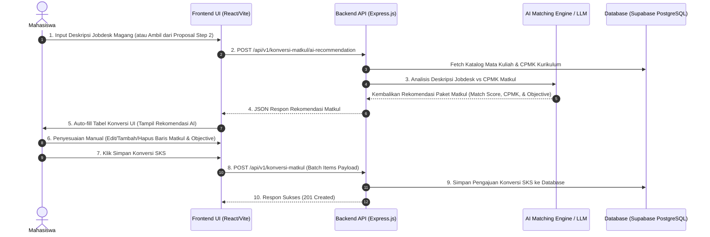

# 🤖 Workflow & Dokumentasi Alur Rekomendasi AI Konversi SKS

Dokumen ini menjelaskan alur kerja (*workflow*) lengkap integrasi **AI Rekomendasi Konversi SKS Mata Kuliah** pada aplikasi BIMA (Konversi Amikom).

---

## 📌 1. Ikhtisar Alur (*High-Level Concept*)



---

## 🔄 2. Langkah-Langkah Alur Kerja Mahasiswa

### Langkah 1: Pengisian / Pengambilan Jobdesk Magang
Mahasiswa dapat menggunakan 2 cara untuk menyediakan informasi jobdesk magang:
1. **Otomatis**: Sistem mengambil teks `deskripsi_kegiatan` & `keahlian_utama` yang sudah diisikan pada **Step 2 (Proposal Magang)**.
2. **Manual Input**: Mahasiswa mengetik/menempelkan rincian jobdesk magang di *textarea* halaman Konversi SKS.

### Langkah 2: Pemicuan Rekomendasi AI
- Mahasiswa menekan tombol **`✨ Rekomendasi AI Konversi`**.
- Frontend memanggil endpoint:
  ```http
  POST /api/v1/konversi-matkul/ai-recommendation
  ```

### Langkah 3: Pemprosesan AI Matching Engine di Backend
- Backend mengekstrak kompetensi dari deskripsi jobdesk magang.
- Backend mencocokkan kata kunci & konteks pekerjaan dengan daftar **CPMK (Capaian Pembelajaran Mata Kuliah)** pada katalog mata kuliah kurikulum.
- AI menghitung persentase kecocokan (*match score*) dan menyusun draf *Objective* pembelajaran industri.

### Langkah 4: Tampilan & Penyesuaian Kembali oleh Mahasiswa (*Interactive Customization*)
- Frontend menerima hasil rekomendasi dari AI dan **langsung mengisi secara otomatis (*auto-fill*)** ke dalam Tabel Konversi UI.
- **Mahasiswa diberikan kebebasan penuh untuk menyesuaikan kembali**:
  - ✏️ **Mengedit Objective**: Menambah atau menyempurnakan poin-poin capaian project.
  - ➕ **Menambah Baris Matkul**: Memilih mata kuliah tambahan dari katalog manual.
  - ❌ **Menghapus Baris Matkul**: Membuang rekomendasi matkul yang kurang sesuai.
  - ⏱️ **Mengatur Durasi**: Memastikan durasi sesuai periode pelaksanaan.

### Langkah 5: Penyimpanan Final Tabel Konversi
- Mahasiswa menekan tombol **`SIMPAN`**.
- Frontend mengirimkan seluruh baris tabel yang sudah disesuaikan ke endpoint:
  ```http
  POST /api/v1/konversi-matkul
  ```

### Langkah 6: Penerusan & Penilaian oleh Dosen Pembimbing Magang (DPL Step 4)
- Setelah disimpan, data usulan konversi **secara otomatis diteruskan ke Dosen Pembimbing (DPL)** yang telah ditetapkan pada **Step 4**.
- Dosen DPL dapat melihat seluruh usulan konversi mahasiswa bimbingannya via:
  ```http
  GET /api/v1/konversi-matkul/dpl/list
  ```
- Dosen DPL memberikan persetujuan (ACC), catatan revisi, serta menginputkan nilai akhir (angka & huruf) via:
  ```http
  POST /api/v1/konversi-matkul/dpl/review
  ```

---

## 📡 3. Spesifikasi API Contracts

### A. Endpoint Rekomendasi AI
**`POST /api/v1/konversi-matkul/ai-recommendation`**

#### Request Headers:
`Authorization: Bearer <TOKEN_MAHASISWA>`

#### Request Body (Opsional):
```json
{
  "deskripsi_kegiatan": "Pengembangan REST API backend Node.js, pengelolaan database PostgreSQL, microservices, dan analisis kebutuhan sistem informasi."
}
```
*Catatan: Jika `deskripsi_kegiatan` dikosongkan, backend secara otomatis mengambil deskripsi kegiatan dari Proposal Step 2 mahasiswa.*

#### Response Payload (200 OK):
```json
{
  "status": 200,
  "message": "Rekomendasi AI konversi matkul berdasarkan deskripsi kegiatan & semester berhasil dibuat",
  "data": {
    "nim": "21.11.4001",
    "nama_mahasiswa": "Budi Santoso",
    "deskripsi_dianalisis": "Pengembangan REST API backend Node.js, pengelolaan database PostgreSQL...",
    "total_sks_direkomendasikan": 12,
    "rekomendasi_matkul": [
      {
        "kode_mk": "ST084",
        "nama_mk": "Pemrograman Web",
        "sks": 4,
        "cpmk": "CPMK16-Mahasiswa mampu merancang perangkat lunak pada berbagai platform digital\nCPMK18-Mahasiswa mampu menganalisis kebutuhan industri",
        "objective": "Memulai Dasar Pemrograman Web. 1. Meneliti, merancang, dan membangun web app responsif.",
        "durasi": "6 Bulan",
        "nilai_angka": null,
        "nilai_huruf": null,
        "match_score": 95,
        "alasan_rekomendasi": "Aktivitas magang melibatkan pengembangan web & REST API yang sangat sesuai dengan CPMK16 & CPMK18"
      },
      {
        "kode_mk": "ST116",
        "nama_mk": "Pemrograman Basis Data",
        "sks": 4,
        "cpmk": "CPMK15-Mahasiswa mampu menganalisis perangkat lunak pada berbagai platform digital\nCPMK16-Mahasiswa mampu merancang perangkat lunak",
        "objective": "Belajar Fundamen Database. 1. Menerapkan Microservices, SQL query, dan database optimization.",
        "durasi": "6 Bulan",
        "nilai_angka": null,
        "nilai_huruf": null,
        "match_score": 92,
        "alasan_rekomendasi": "Aktivitas magang mencakup pengelolaan database & query SQL yang cocok dengan CPMK15 & CPMK16"
      },
      {
        "kode_mk": "ST055",
        "nama_mk": "Arsitektur REST API & Cloud Computing",
        "sks": 4,
        "cpmk": "CPMK12-Mahasiswa mampu membangun API microservices dan cloud infrastructure",
        "objective": "Membangun REST API scalable, backend Node.js, dan deployment cloud server.",
        "durasi": "6 Bulan",
        "nilai_angka": null,
        "nilai_huruf": null,
        "match_score": 90,
        "alasan_rekomendasi": "Proyek magang membangun REST API & backend scalable untuk platform digital"
      }
    ]
  }
}
```

---

### B. Endpoint Simpan Tabel Konversi (Batch Submit)
**`POST /api/v1/konversi-matkul`**

#### Request Headers:
`Authorization: Bearer <TOKEN_MAHASISWA>`

#### Request Body (Hasil Penyesuaian Mahasiswa):
```json
{
  "mode": "AI_RECOMMENDATION",
  "items": [
    {
      "kode_mk": "ST084",
      "nama_mk": "Pemrograman Web",
      "sks": 4,
      "cpmk": "CPMK16-Mahasiswa mampu merancang perangkat lunak pada berbagai platform digital\nCPMK18-Mahasiswa mampu menganalisis kebutuhan industri",
      "objective": "Memulai Dasar Pemrograman Web. 1. Meneliti, merancang, dan membangun web app responsif berbasis REST API.",
      "durasi": "6 Bulan",
      "nilai_angka": 88,
      "nilai_huruf": "A"
    },
    {
      "kode_mk": "ST116",
      "nama_mk": "Pemrograman Basis Data",
      "sks": 4,
      "cpmk": "CPMK15-Mahasiswa mampu menganalisis perangkat lunak pada berbagai platform digital\nCPMK16-Mahasiswa mampu merancang perangkat lunak",
      "objective": "Belajar Fundamen Database. 1. Menerapkan Microservices, SQL query, dan database optimization.",
      "durasi": "6 Bulan",
      "nilai_angka": 85,
      "nilai_huruf": "A"
    },
    {
      "kode_mk": "ST091",
      "nama_mk": "Analisis dan Desain Sistem Informasi",
      "sks": 4,
      "cpmk": "CPMK11-Mahasiswa mampu menghasilkan produk ekonomi kreatif digital dalam bidang informatika",
      "objective": "Memulai Dasar Perancangan Sistem. 1. Meneliti, menganalisis sistem, UML diagram, dan proses bisnis.",
      "durasi": "6 Bulan",
      "nilai_angka": 82,
      "nilai_huruf": "A-"
    }
  ]
}
```

---

## 💻 4. Contoh Code Integrasi Frontend (React Component)

```javascript
import React, { useState } from "react";

export default function KonversiSksPage() {
  const [rows, setRows] = useState([]);
  const [loadingAi, setLoadingAi] = useState(false);

  // 1. Memanggil Rekomendasi AI
  const handleGetAiRecommendation = async () => {
    setLoadingAi(true);
    try {
      const res = await fetch("/api/v1/konversi-matkul/ai-recommendation", {
        method: "POST",
        headers: {
          "Content-Type": "application/json",
          Authorization: `Bearer ${localStorage.getItem("token")}`,
        },
      });
      const result = await res.json();
      if (result.status === 200) {
        // Auto-fill tabel konversi UI dengan rekomendasi AI
        setRows(result.data.rekomendasi_matkul);
      }
    } catch (err) {
      console.error("Gagal mendapatkan rekomendasi AI:", err);
    } finally {
      setLoadingAi(false);
    }
  };

  // 2. Mahasiswa mengedit Objective / Nilai
  const handleRowChange = (index, field, value) => {
    const updated = [...rows];
    updated[index][field] = value;
    setRows(updated);
  };

  // 3. Menambah Baris Baru secara Manual
  const handleAddRow = () => {
    setRows([
      ...rows,
      {
        kode_mk: "ST091",
        nama_mk: "Analisis dan Desain Sistem Informasi",
        sks: 4,
        cpmk: "CPMK11-Mahasiswa mampu menganalisis kebutuhan",
        objective: "",
        durasi: "6 Bulan",
        nilai_angka: null,
        nilai_huruf: null,
      },
    ]);
  };

  // 4. Menghapus Baris Matkul
  const handleRemoveRow = (index) => {
    setRows(rows.filter((_, i) => i !== index));
  };

  // 5. Simpan Tabel Konversi
  const handleSave = async () => {
    try {
      const res = await fetch("/api/v1/konversi-matkul", {
        method: "POST",
        headers: {
          "Content-Type": "application/json",
          Authorization: `Bearer ${localStorage.getItem("token")}`,
        },
        body: JSON.stringify({
          mode: "AI_RECOMMENDATION",
          items: rows,
        }),
      });
      const result = await res.json();
      if (result.status === 201) {
        alert("Konversi SKS Berhasil Disimpan!");
      }
    } catch (err) {
      console.error("Gagal menyimpan konversi:", err);
    }
  };

  return (
    <div className="p-6">
      <h1 className="text-xl font-bold mb-4">Step 5: Konversi SKS Mata Kuliah</h1>
      
      <div className="flex gap-3 mb-4">
        <button
          onClick={handleGetAiRecommendation}
          disabled={loadingAi}
          className="bg-purple-600 text-white px-4 py-2 rounded-lg font-semibold"
        >
          {loadingAi ? "Sedang Menganalisis Jobdesk..." : "✨ Rekomendasi AI"}
        </button>
        <button onClick={handleAddRow} className="bg-gray-800 text-white px-4 py-2 rounded-lg font-semibold">
          + Tambah Baris
        </button>
      </div>

      <table className="w-full border-collapse border border-gray-200">
        <thead>
          <tr className="bg-gray-100">
            <th className="border p-2">Kode Matkul</th>
            <th className="border p-2">Nama Matkul</th>
            <th className="border p-2">SKS Matkul</th>
            <th className="border p-2">CPMK</th>
            <th className="border p-2">Objective</th>
            <th className="border p-2">Aksi</th>
          </tr>
        </thead>
        <tbody>
          {rows.map((row, idx) => (
            <tr key={idx}>
              <td className="border p-2">{row.kode_mk}</td>
              <td className="border p-2">{row.nama_mk}</td>
              <td className="border p-2 text-center">{row.sks}</td>
              <td className="border p-2 text-xs">{row.cpmk}</td>
              <td className="border p-2">
                <textarea
                  value={row.objective}
                  onChange={(e) => handleRowChange(idx, "objective", e.target.value)}
                  className="w-full border p-1 rounded"
                />
              </td>
              <td className="border p-2 text-center">
                <button onClick={() => handleRemoveRow(idx)} className="text-red-500 font-bold">
                  Hapus
                </button>
              </td>
            </tr>
          ))}
        </tbody>
      </table>

      <button onClick={handleSave} className="mt-4 bg-indigo-600 text-white px-6 py-2 rounded-lg font-semibold">
        SIMPAN
      </button>
    </div>
  );
}
```

---

## 🏆 Keunggulan Workflow Ini:
1. 🔒 **Aman**: Seluruh kredensial & logika AI berada di Backend.
2. ⚡ **Otomatis & Presisi**: Mengisi otomatis Kode MK, SKS, CPMK, dan Draf Objective.
3. ✏️ **Fleksibel (*Human in the Loop*)**: Mahasiswa dapat menyesuaikan kembali (*edit/tambah/hapus*) seluruh item sebelum menekan tombol **SIMPAN**.
