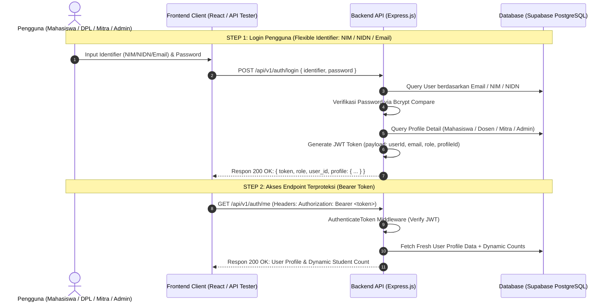

# 🔐 Dokumentasi Lengkap Autentikasi & Manajemen Akun (UNIKA.IN / BIMA)

Dokumen ini berisi panduan teknis, **userflow**, **skema autentikasi**, **peran pengguna (RBAC)**, **sequence diagram**, dan **kredensial seeder** untuk modul autentikasi pada sistem BIMA (MBKM Fakultas Ilmu Komputer Universitas Amikom Yogyakarta).

---

## 📌 1. Skema & Aturan Autentikasi (RBAC Matrix)

Sistem menggunakan **JSON Web Token (JWT)** berbasis skema **Bearer Token** (`Authorization: Bearer <token>`) dengan hashing password menggunakan **Bcrypt** (`saltRounds = 10`).

| Peran (Role) | Metode Pendaftaran | Pengenal Login (Identifier) | Akses Fitur Utama |
| :--- | :--- | :--- | :--- |
| **`MAHASISWA`** | Registrasi Mandiri (`/register-mahasiswa`) | **NIM** / Email Student & Password | Pengajuan 5 Step MBKM, Form Konversi SKS, Surat Akhir Terima Kasih |
| **`DPL`** *(Dosen Pembimbing)* | Dibuatkan oleh Admin Kaprodi | **NIDN** / Email Dosen & Password | Dashboard DPL, Profil Bimbingan, Review Konversi SKS (ACC / Revisi) |
| **`MITRA`** *(Mitra Industri)* | Dibuatkan oleh Admin Kaprodi | **Email Supervisor** & Password | Dashboard Mitra, Daftar Mahasiswa Magang, Penilaian Akhir & Sertifikat |
| **`ADMIN_PRODI`** / **`DEKAN`** | Pre-seeded / Database Administrator | **Email Admin** & Password | Dashboard Eksekutif Analytics, Tracking 5 Step, Kelola DPL, Kelola Mitra, Master Data MK & CPMK |

---

## 🔄 2. Userflow & Sequence Diagram Autentikasi



---

## 🔑 3. Daftar Kredensial Uji Coba (Seeder Accounts)

Seluruh akun seeder siap digunakan untuk pengujian API dan frontend.

### 1. Dosen Pembimbing Lapangan (DPL)
| NIDN | Email DPL | Password | Nama Dosen | Bidang Keahlian |
| :--- | :--- | :--- | :--- | :--- |
| `0512038901` | `indah.susanti@amikom.ac.id` | `Dosen#1234` | Dr. Indah Susanti, M.Kom | Software Engineering & Web Dev |
| `0515088502` | `bambang.k@amikom.ac.id` | `Dosen#1234` | Bambang Kurniawan, M.T. | Database & Big Data |
| `0509077801` | `kusrini@amikom.ac.id` | `Dosen#1234` | Drs. Kusrini, M.Kom. | Artificial Intelligence |
| `0522108201` | `andi.sunyoto@amikom.ac.id` | `Dosen#1234` | Andi Sunyoto, M.Kom | Cloud Computing & Microservices |
| `0518048601` | `dharmawan@amikom.ac.id` | `Dosen#1234` | Dharmawan, M.T. | Cyber Security & Networks |

### 2. Mahasiswa
| NIM | Email Student | Password | Nama Mahasiswa | Status Konversi Baseline |
| :--- | :--- | :--- | :--- | :--- |
| ⭐️ `24.11.6666` | `fathur.6666@students.amikom.ac.id` | `12345678` | **Fathur Rahman** | **Selesai 5 Step + Rating Mitra (100% Complete)** |
| `21.11.4001` | `budi.santoso@students.amikom.ac.id` | `Budi#1234` | Budi Santoso | Disetujui DPL |
| `21.11.4002` | `siti.aminah@students.amikom.ac.id` | `Mhs#1234` | Siti Aminah | Menunggu Review DPL |
| `21.11.4003` | `rizky.pratama@students.amikom.ac.id` | `Mhs#1234` | Rizky Pratama | Revisi DPL |

### 3. Mitra Industri & Admin Kaprodi
| Role | Email | Password | Nama / Perusahaan |
| :--- | :--- | :--- | :--- |
| **`MITRA`** | `rian.hidayat@goto.com` | `Mtr#1234` | Rian Hidayat (PT GoTo Gojek Tokopedia Tbk) |
| **`ADMIN_PRODI`** | `kaprodi.if@amikom.ac.id` | `Admin#1234` | Admin Kaprodi Informatika Amikom |

---

## ⚡ 4. Spesifikasi Endpoint API Autentikasi

### 1. Login Flexible (Multi-Identifier: NIM / NIDN / Email)
- **URL**: `POST /api/v1/auth/login`
- **Request Body (Login DPL via NIDN)**:
  ```json
  {
    "identifier": "0512038901",
    "password": "Dosen#1234"
  }
  ```
- **Request Body (Login Mahasiswa via NIM)**:
  ```json
  {
    "identifier": "21.11.4001",
    "password": "Budi#1234"
  }
  ```
- **Response Format (200 OK)**:
  ```json
  {
    "message": "Login berhasil",
    "token": "eyJhbGciOiJIUzI1NiIsInR5cCI6IkpXVCJ9...",
    "data": {
      "id": 2,
      "email": "indah.susanti@amikom.ac.id",
      "role": "DPL",
      "is_active": true,
      "created_at": "2026-07-27T04:17:06.404886",
      "profile": {
        "nidn": "0512038901",
        "nama": "Dr. Indah Susanti, M.Kom",
        "bidang_keahlian": "Software Engineering & Web Dev",
        "email": "indah.susanti@amikom.ac.id",
        "jumlah_mahasiswa_bimbingan": 2,
        "total_mahasiswa_bimbingan": 2,
        "is_active": true,
        "user_id": 2
      }
    }
  }
  ```

---

### 2. Profil User Aktif (`/me`)
- **URL**: `GET /api/v1/auth/me`
- **Headers**: `Authorization: Bearer <TOKEN>`
- **Response Format (200 OK)**:
  ```json
  {
    "status": 200,
    "message": "Profil pengguna berhasil diambil",
    "data": {
      "id": 2,
      "email": "indah.susanti@amikom.ac.id",
      "role": "DPL",
      "profile": {
        "nidn": "0512038901",
        "nama": "Dr. Indah Susanti, M.Kom",
        "bidang_keahlian": "Software Engineering & Web Dev",
        "email": "indah.susanti@amikom.ac.id",
        "jumlah_mahasiswa_bimbingan": 2
      }
    }
  }
  ```

---

### 3. Registrasi Mahasiswa Mandiri
- **URL**: `POST /api/v1/auth/register-mahasiswa`
- **Request Body**:
  ```json
  {
    "nim": "21.11.4005",
    "nama": "Rizky Ramadhan",
    "email": "rizky.ramadhan@students.amikom.ac.id",
    "password": "Password123",
    "prodi": "Informatika",
    "angkatan": "2021"
  }
  ```
- **Response Format (201 Created)**:
  ```json
  {
    "status": 201,
    "message": "Registrasi mahasiswa berhasil. Silakan login.",
    "data": {
      "nim": "21.11.4005",
      "nama": "Rizky Ramadhan",
      "email": "rizky.ramadhan@students.amikom.ac.id",
      "role": "MAHASISWA"
    }
  }
  ```

---

## 🧪 5. Panduan Testing / cURL

```bash
# 1. Login DPL via NIDN
curl -X POST http://localhost:3001/api/v1/auth/login \
  -H "Content-Type: application/json" \
  -d '{"identifier": "0512038901", "password": "Dosen#1234"}'

# 2. Get User Profile (/me)
curl -X GET http://localhost:3001/api/v1/auth/me \
  -H "Authorization: Bearer <TOKEN>"

# 3. Login Mahasiswa via NIM
curl -X POST http://localhost:3001/api/v1/auth/login \
  -H "Content-Type: application/json" \
  -d '{"identifier": "21.11.4001", "password": "Budi#1234"}'
```
