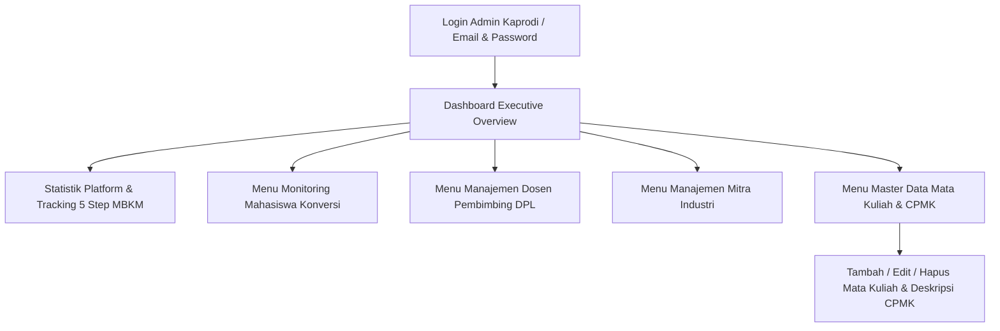
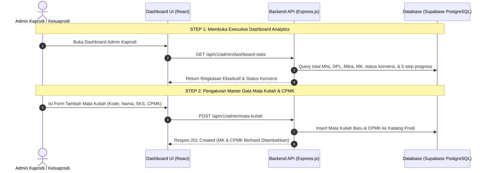

# 👑 Dokumentasi Lengkap Dashboard Admin Kaprodi (Program Studi)

Dokumen ini berisi panduan teknis, **userflow**, **arsitektur API**, **struktur data**, dan **pengaturan master data** untuk **Dashboard Admin Kaprodi (S1 Informatika)** pada sistem BIMA (MBKM Fakultas Ilmu Komputer Universitas Amikom Yogyakarta).

---

## 📌 1. Ikhtisar Dashboard Admin Kaprodi

Dashboard Admin Kaprodi merupakan pusat kendali tertinggi (Executive Control Center) bagi **Ketua Program Studi / Sekretaris Prodi Informatika / Dekan** untuk:
1. Memantau seluruh statistik platform, mulai dari total mahasiswa konversi, total DPL, total Mitra Industri, total Mata Kuliah katalog, dan total SKS yang dikonversi.
2. Memantau progres alur kerja mahasiswa di seluruh **5 Step MBKM** (Pengajuan FIK, Proposal Magang, Surat Pengantar, Plotting DPL, dan Tabel Konversi SKS).
3. Mengelola akun DPL & Mitra Industri (ditambah pembuatan akun baru secara otomatis yang memicu pengiriman kredensial via email).
4. Mengelola Master Data **Katalog Mata Kuliah & CPMK (Capaian Pembelajaran Mata Kuliah)** prodi yang digunakan untuk rekomendasi AI dan pencocokan sks.
5. Mengelola Master Data **CPL (Capaian Pembelajaran Lulusan) & CPMK**.



---

## 🔄 2. Userflow Monitoring & Master Data Setting



---

## ⚡ 3. Daftar Endpoint API Admin Kaprodi

Semua endpoint Admin dilindungi oleh authentication token (`Bearer JWT`) dan role authorization (`requireRole(["ADMIN_PRODI", "DEKAN"])`). Endpoint berada pada prefix `/api/v1/admin`.

### 1. Executive Analytics & Dashboard Stats
- **URL**: `GET /api/v1/admin/dashboard-stats`
- **Response Format (200 OK)**:
  ```json
  {
    "status": 200,
    "message": "Statistik Dashboard Admin Kaprodi Informatika berhasil diambil",
    "data": {
      "prodi_info": {
        "nama_prodi": "S1 Informatika",
        "fakultas": "Fakultas Ilmu Komputer (FIK)",
        "universitas": "Universitas Amikom Yogyakarta",
        "tahun_akademik": "2026/2027 (Semester Genap)"
      },
      "ringkasan_eksekutif": {
        "total_mahasiswa": 10,
        "total_dpl": 5,
        "total_mitra_industri": 5,
        "total_mata_kuliah_katalog": 30,
        "total_sks_katalog": 120
      },
      "status_konversi": {
        "menunggu_review_dpl": 3,
        "disetujui_dpl": 5,
        "revisi_dpl": 2,
        "selesai_konversi": 1,
        "total_usulan_konversi": 11
      },
      "progress_steps_mbkm": {
        "step_1_fik": 10,
        "step_2_proposal": 10,
        "step_3_surat_pengantar": 10,
        "step_4_dpl": 10,
        "step_5_konversi": 10,
        "surat_akhir_terima_kasih": 1
      }
    }
  }
  ```

---

### 2. Monitoring & Daftar Mahasiswa Konversi
- **URL**: `GET /api/v1/admin/mahasiswa`
- **Query Params**:
  - `search` *(string, opsional)*: Cari NIM / Nama / Instansi.
  - `status` *(string, opsional)*: Filter `Menunggu Review DPL`, `Disetujui DPL`, `Revisi DPL`.
- **Response Format (200 OK)**:
  ```json
  {
    "status": 200,
    "message": "Daftar mahasiswa konversi berhasil diambil oleh Admin Kaprodi",
    "data": {
      "total_mahasiswa": 10,
      "mahasiswa": [
        {
          "nim": "21.11.4001",
          "nama": "Budi Santoso",
          "email": "budi.santoso@students.amikom.ac.id",
          "prodi": "Informatika",
          "magang": {
            "nama_instansi": "PT GoTo Gojek Tokopedia Tbk",
            "posisi": "Fullstack Developer Intern"
          },
          "dpl": {
            "nidn_dpl": "0512038901",
            "nama_dpl": "Dr. Indah Susanti, M.Kom"
          },
          "konversi_sks": {
            "total_sks": 20,
            "status_review_dpl": "Disetujui DPL"
          }
        }
      ]
    }
  }
  ```

---

### 3. Detail Komprehensif Mahasiswa (Monitoring 5 Steps)
- **URL**: `GET /api/v1/admin/mahasiswa/:nim`
- **Response Format (200 OK)**:
  ```json
  {
    "status": 200,
    "message": "Detail komprehensif data mahasiswa Budi Santoso (NIM: 21.11.4001) berhasil diambil",
    "data": {
      "mahasiswa": {
        "nim": "21.11.4001",
        "nama": "Budi Santoso",
        "prodi": "Informatika"
      },
      "dpl": {
        "nidn_dpl": "0512038901",
        "nama_dpl": "Dr. Indah Susanti, M.Kom",
        "sk_dpl_url": "https://fik.amikom.ac.id/sk-dpl/SK-DPL-21.11.4001.pdf"
      },
      "progress_steps": {
        "step_1_fik": "Disetujui",
        "step_2_proposal": "Disetujui Kaprodi",
        "step_3_surat_pengantar": "Selesai (PDF Diterbitkan)",
        "step_4_dpl": "SK DPL Diterbitkan",
        "step_5_konversi": "Disetujui DPL",
        "surat_akhir_terima_kasih": "Sudah Dinilai Mitra"
      }
    }
  }
  ```

---

### 4. Master Data: Katalog Mata Kuliah & CPMK
- **GET All**: `GET /api/v1/admin/mata-kuliah`
- **POST Create**: `POST /api/v1/admin/mata-kuliah`
- **PUT Update**: `PUT /api/v1/admin/mata-kuliah/:id`
- **DELETE Remove**: `DELETE /api/v1/admin/mata-kuliah/:id`
- **Request Body (POST Create)**:
  ```json
  {
    "kode_mk": "ST120",
    "nama_mk": "Cloud Architecture & Microservices",
    "sks": 4,
    "semester": 6,
    "cpmk": "CPMK20-Mahasiswa mampu merancang arsitektur cloud server, Docker container, dan microservices skala besar",
    "kategori": "Wajib Prodi"
  }
  ```

---

### 5. Manajemen DPL & Mitra (Create Account & Auto Send Email)
- **Tambah DPL**: `POST /api/v1/admin/create-dpl` atau `POST /api/v1/admin/dosen`
- **Tambah Mitra**: `POST /api/v1/admin/create-mitra` atau `POST /api/v1/admin/mitra`
- **Edit DPL**: `PUT /api/v1/admin/dosen/:nidn`
- **Daftar DPL**: `GET /api/v1/admin/dosen`
- **Daftar Mitra**: `GET /api/v1/admin/mitra`

---

## 🧪 4. Panduan Testing / cURL

```bash
# 1. Login sebagai Admin Kaprodi
curl -X POST http://localhost:3001/api/v1/auth/login \
  -H "Content-Type: application/json" \
  -d '{"identifier": "kaprodi.if@amikom.ac.id", "password": "Admin#1234"}'

# 2. Get Executive Dashboard Stats
curl -X GET http://localhost:3001/api/v1/admin/dashboard-stats \
  -H "Authorization: Bearer <TOKEN>"

# 3. Get Master Data Mata Kuliah & CPMK
curl -X GET http://localhost:3001/api/v1/admin/mata-kuliah \
  -H "Authorization: Bearer <TOKEN>"

# 4. Tambah Mata Kuliah & CPMK Baru
curl -X POST http://localhost:3001/api/v1/admin/mata-kuliah \
  -H "Authorization: Bearer <TOKEN>" \
  -H "Content-Type: application/json" \
  -d '{
    "kode_mk": "ST120",
    "nama_mk": "Cloud Architecture & Microservices",
    "sks": 4,
    "cpmk": "CPMK20-Mahasiswa mampu merancang arsitektur cloud server, Docker container, dan microservices",
    "kategori": "Wajib Prodi"
  }'
```
