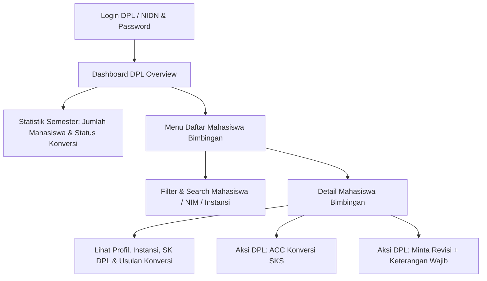
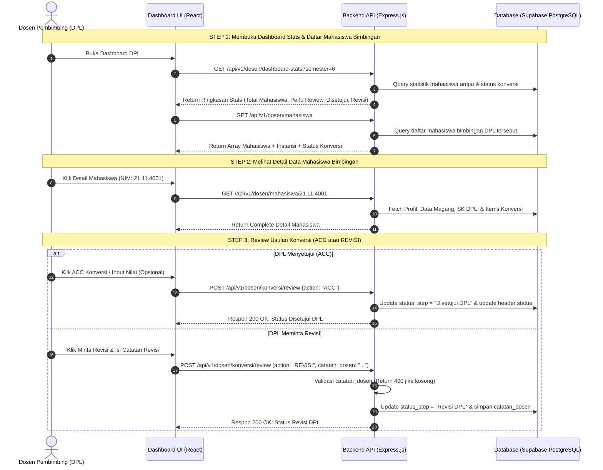

# 👨‍🏫 Dokumentasi Lengkap Dashboard Dosen Pembimbing Lapangan (DPL)

Dokumen ini berisi panduan teknis, **userflow**, **arsitektur API**, **struktur data**, dan **aturan validasi (ACC/Revisi Konversi SKS)** untuk **Dashboard DPL / Dosen Pembimbing Lapangan** pada sistem BIMA (MBKM Fakultas Ilmu Komputer Universitas Amikom Yogyakarta).

---

## 📌 1. Ikhtisar Dashboard DPL

Dashboard DPL merupakan pusat kendali bagi **Dosen Pembimbing Lapangan (DPL)** yang memiliki 2 fitur & menu utama:

1. **Menu Mahasiswa Bimbingan / Review Konversi SKS**:
   - Menampilkan mahasiswa yang mengajukan konversi SKS magang (`GET /api/v1/dosen/mahasiswa`).
   - Setiap mahasiswa memiliki **data profil, nama tempat magang / instansi, posisi magang, 5 steps progress, serta 5 mata kuliah konversi & objective pekerjaan yang 100% dinamis & unik per NIM** (`GET /api/v1/dosen/mahasiswa/:nim`).
   - DPL dapat meninjau **Review Klaim Nilai** (ACC / Revisi) serta menginputkan nilai angka/huruf dan catatan evaluasi (`POST /api/v1/dosen/konversi/review`).
2. **Menu Kelola List Mahasiswa Pendampingan & Export Excel**:
   - Menu khusus untuk melihat seluruh daftar mahasiswa yang didampingi beserta fitur **Export to Excel (.xls / .csv)** (`GET /api/v1/dosen/export/mahasiswa?format=excel`).



---

## 🔄 2. Userflow & Sequence Diagram Review DPL



---

## ⚡ 3. Daftar Endpoint API DPL

Semua endpoint DPL dilindungi oleh authentication token (`Bearer JWT`) dan role authorization (`requireRole(["DPL", "ADMIN_PRODI"])`). Endpoint ditempatkan pada prefix `/api/v1/dosen` (dan aliased ke `/api/v1/dpl`).

### 1. Ringkasan Statistik Dashboard DPL
- **URL**: `GET /api/v1/dosen/dashboard-stats` (Alias: `GET /api/v1/dpl/dashboard-stats`)
- **Query Params**:
  - `semester` *(integer, opsional)*: Semester aktif (default: `6`).
- **Response Format (200 OK)**:
  ```json
  {
    "status": 200,
    "message": "Statistik Dashboard DPL berhasil diambil",
    "data": {
      "dosen": {
        "nidn": "0512038901",
        "nama": "Dr. Indah Susanti, M.Kom",
        "email": "indah.susanti@amikom.ac.id",
        "bidang_keahlian": "Software Engineering & Web Dev"
      },
      "filter_semester": 6,
      "total_mahasiswa_ampu": 2,
      "ringkasan_konversi": {
        "total_sks_dikembangkan": 40,
        "total_perlu_review": 1,
        "total_disetujui": 1,
        "total_revisi": 0
      },
      "mahasiswa_ampu_ringkasan": [
        {
          "nim": "21.11.4001",
          "nama": "Budi Santoso",
          "prodi": "Informatika",
          "semester": 6,
          "posisi": "Fullstack Developer Intern",
          "nama_instansi": "PT GoTo Gojek Tokopedia Tbk"
        }
      ]
    }
  }
  ```

---

### 2. Daftar Mahasiswa Bimbingan yang Diampu DPL
- **URL**: `GET /api/v1/dosen/mahasiswa` (Alias: `GET /api/v1/dpl/mahasiswa`)
- **Query Params**:
  - `search` *(string, opsional)*: Kata kunci pencarian (Nama / NIM / Instansi).
  - `status_konversi` *(string, opsional)*: Filter status usulan (`Menunggu Review DPL`, `Disetujui DPL`, `Revisi DPL`).
- **Response Format (200 OK)**:
  ```json
  {
    "status": 200,
    "message": "Daftar mahasiswa yang diampu DPL berhasil diambil",
    "data": {
      "dosen": {
        "nidn": "0512038901",
        "nama": "Dr. Indah Susanti, M.Kom"
      },
      "total_mahasiswa": 2,
      "mahasiswa": [
        {
          "nim": "21.11.4001",
          "nama": "Budi Santoso",
          "email": "budi.santoso@students.amikom.ac.id",
          "prodi": "Informatika",
          "angkatan": "2021",
          "foto_profile": "https://ui-avatars.com/api/?name=Budi+Santoso",
          "magang": {
            "id_magang_fakultas": "FIK6199373",
            "nama_instansi": "PT GoTo Gojek Tokopedia Tbk",
            "posisi": "Fullstack Developer Intern",
            "jenis_program": "Magang Mandiri / MSIB",
            "durasi_bulan": 6,
            "supervisor_mitra": "Rian Hidayat (Lead Eng GoTo)"
          },
          "konversi_sks": {
            "status_konversi": "Disetujui DPL",
            "total_sks": 20,
            "total_matkul": 5,
            "mode_input": "AI_RECOMMENDATION"
          }
        }
      ]
    }
  }
  ```

---

### 3. Detail Data Mahasiswa Bimbingan DPL
- **URL**: `GET /api/v1/dosen/mahasiswa/:nim` (Alias: `GET /api/v1/dpl/mahasiswa/:nim`)
- **Path Parameter**: `nim` (misal: `21.11.4001`).
- **Response Format (200 OK)**:
  ```json
  {
    "status": 200,
    "message": "Detail data mahasiswa bimbingan Budi Santoso (NIM: 21.11.4001) berhasil diambil",
    "data": {
      "dosen": {
        "nidn": "0512038901",
        "nama": "Dr. Indah Susanti, M.Kom"
      },
      "mahasiswa": {
        "nim": "21.11.4001",
        "nama": "Budi Santoso",
        "email": "budi.santoso@students.amikom.ac.id",
        "prodi": "Informatika",
        "angkatan": "2021"
      },
      "pengajuan_magang": {
        "id_magang_fakultas": "FIK6199373",
        "nama_instansi": "PT GoTo Gojek Tokopedia Tbk",
        "posisi": "Fullstack Developer Intern",
        "jenis_program": "Magang Mandiri / MSIB",
        "durasi_bulan": 6,
        "tanggal_mulai": "2026-02-01",
        "tanggal_selesai": "2026-07-31"
      },
      "pengajuan_dpl": {
        "sks_ditempuh": 110,
        "sk_dpl_url": "https://fik.amikom.ac.id/sk-dpl/SK-DPL-21.11.4001.pdf",
        "status_pengajuan": "Disetujui"
      },
      "konversi_sks": {
        "id_konversi": 1,
        "mode_input": "AI_RECOMMENDATION",
        "total_sks": 20,
        "status_konversi": "Disetujui DPL",
        "items_konversi": [
          {
            "id_item": 1,
            "kode_mk": "ST084",
            "nama_mk": "Pemrograman Web",
            "sks": 4,
            "cpmk": "CPMK16-Mahasiswa mampu merancang web app responsif",
            "objective": "Merancang & mendeploy dashboard React.js responsif.",
            "status_step": "Disetujui DPL",
            "catatan_dosen": "Sangat baik, arsitektur frontend rapi.",
            "nilai_angka": 90,
            "nilai_huruf": "A"
          }
        ]
      }
    }
  }
  ```

---

### 4. Review Konversi SKS oleh DPL (ACC & Revisi)
- **URL**: `POST /api/v1/dosen/konversi/review` & `PUT /api/v1/dosen/konversi/review`
- **Shortcut Endpoints**:
  - `POST /api/v1/dosen/konversi/acc`
  - `POST /api/v1/dosen/konversi/revisi`
- **Request Body (Contoh ACC)**:
  ```json
  {
    "id_item_konversi": 1,
    "nim": "21.11.4001",
    "action": "ACC",
    "catatan_dosen": "Objective dan CPMK sudah sesuai standar industri",
    "nilai_angka": 90,
    "nilai_huruf": "A"
  }
  ```
- **Request Body (Contoh REVISI - Catatan Wajib)**:
  ```json
  {
    "id_item_konversi": 1,
    "nim": "21.11.4001",
    "action": "REVISI",
    "catatan_dosen": "Harap perjelas perancangan arsitektur microservices pada objective mata kuliah ini."
  }
  ```
- **Aturan Validasi Utama**:
  - Parameter `action`: `"ACC"`, `"REVISI"`, atau `"INPUT_NILAI"`.
  - **Catatan Revisi Wajib**: Jika `action = "REVISI"` dan `catatan_dosen` kosong/hanya spasi, API akan memberikan respon `400 Bad Request` dengan pesan: *"Catatan / keterangan revisi wajib diisi ketika dosen meminta revisi"*.
- **Response Format (200 OK)**:
  ```json
  {
    "status": 200,
    "message": "Review konversi SKS oleh Dosen DPL (Dr. Indah Susanti, M.Kom) berhasil disimpan (Status: Disetujui DPL)",
    "data": {
      "id_item_konversi": 1,
      "nim": "21.11.4001",
      "action": "ACC",
      "status_step": "Disetujui DPL",
      "status_konversi": "Disetujui DPL",
      "catatan_dosen": "Objective dan CPMK sudah sesuai standar industri",
      "nilai_angka": 90,
      "nilai_huruf": "A"
    }
  }
  ```

---

## 🧪 4. Panduan Testing / cURL

```bash
# 1. Login sebagai DPL
curl -X POST http://localhost:3001/api/v1/auth/login \
  -H "Content-Type: application/json" \
  -d '{"identifier": "0512038901", "password": "Dosen#1234"}'

# 2. Get Dashboard Stats
curl -X GET http://localhost:3001/api/v1/dosen/dashboard-stats \
  -H "Authorization: Bearer <TOKEN>"

# 3. Get Mahasiswa List
curl -X GET http://localhost:3001/api/v1/dosen/mahasiswa \
  -H "Authorization: Bearer <TOKEN>"

# 4. Get Detail Mahasiswa
curl -X GET http://localhost:3001/api/v1/dosen/mahasiswa/21.11.4001 \
  -H "Authorization: Bearer <TOKEN>"

# 5. Submit Revisi (Akan Error 400 jika catatan kosong)
curl -X POST http://localhost:3001/api/v1/dosen/konversi/revisi \
  -H "Authorization: Bearer <TOKEN>" \
  -H "Content-Type: application/json" \
  -d '{"id_item_konversi": 1, "nim": "21.11.4001", "catatan_dosen": "Perbaiki deskripsi objective"}'
```
