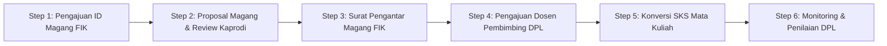
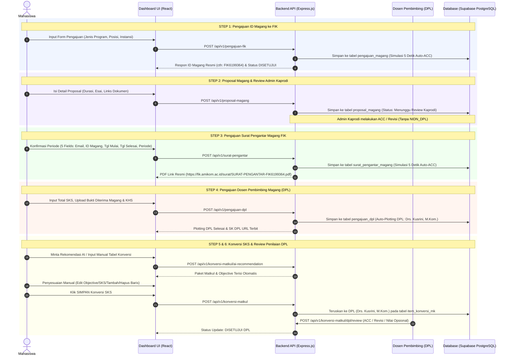

# 🎓 Dokumentasi Lengkap Dashboard Mahasiswa BIMA (Magang & Konversi SKS FIK)

Dokumen ini berisi panduan teknis, **workflow**, **userflow**, **arsitektur API**, **struktur database**, dan **interaksi komponen UI** untuk **Dashboard Mahasiswa** pada sistem BIMA (MBKM Fakultas Ilmu Komputer Universitas Amikom Yogyakarta).

---

## 📌 1. Ikhtisar Sistem & Dashboard Mahasiswa

Dashboard Mahasiswa merupakan pusat kendali tunggal (*single pane of glass*) bagi mahasiswa Fakultas Ilmu Komputer (FIK) untuk memantau dan menyelesaikan **5 Tahap Pengajuan Magang & Konversi SKS**:



---

## 🔄 2. Userflow Lengkap (Langkah demi Langkah)



---

## ⚡ Aturan Validasi Pengajuan per Semester & Perbaikan/Revisi

1. **Pembatasan 1 Kali per Semester**:
   - Mahasiswa hanya dapat membuat 1 kali pengajuan magang baru per semester berjalan (HTTP 409 Conflict jika mencoba membuat pengajuan ganda).
2. **Pengecualian Status Ditolak / Revisi**:
   - Jika pengajuan sebelumnya atau mata kuliah konversi mendapatkan status **`Ditolak`** / **`Revisi`** / **`Revisi DPL`**, mahasiswa **DIPERBOLEHKAN untuk mengedit dan mengirimkan kembali (*resubmit*)** pengajuan tersebut pada semester yang sama berdasarkan catatan perbaikan dosen (*catatan_dosen*).
   - Setelah diperbarui oleh mahasiswa, status otomatis kembali ke **`Menunggu Review DPL`** / **`Diproses`** untuk dievaluasi ulang oleh dosen.

---

## 📡 3. Unified All-Steps API Contract (Pusat Data Dashboard)

Untuk menampilkan seluruh riwayat dan status perkembangan mahasiswa dalam 1 tampilan tabel ringkas, Frontend memanggil endpoint terpadu:

### **`GET /api/v1/pengajuan-fik/all-steps`**
**Headers:** `Authorization: Bearer <TOKEN_MAHASISWA>`

#### Sample Response Payload (200 OK):
```json
{
  "status": 200,
  "message": "Data pengajuan magang Step 1, 2, 3, 4, dan 5 berhasil diambil",
  "data": {
    "mahasiswa": {
      "nama": "Budi Santoso",
      "nim": "21.11.4001",
      "email": "budi.santoso@students.amikom.ac.id",
      "prodi": "Informatika",
      "angkatan": "2021"
    },
    "current_step": 6,
    "riwayat_pengajuan": [
      {
        "id": "step1-13",
        "step": 1,
        "jenis_pengajuan": "Pengajuan ID Magang",
        "sub_info": "Semester 6 - 2026/2027",
        "nama_instansi": "PT Amikom Tech Digital (Fullstack Engineer Intern)",
        "kepada_yth": "-",
        "tanggal_pengajuan": "27 Juli 2026",
        "status": "DISETUJUI",
        "id_magang_fakultas": "FIK6199373",
        "surat_pengantar_url": "https://fik.amikom.ac.id/surat/SURAT-PENGANTAR-FIK6199373.pdf"
      },
      {
        "id": "step2-3",
        "step": 2,
        "jenis_pengajuan": "Pengajuan Proposal ke Prodi",
        "sub_info": "Durasi: 01.08.2026 sampai dengan 31.01.2027",
        "nama_instansi": "PT Amikom Tech Digital",
        "kepada_yth": "Admin Kaprodi Informatika",
        "tanggal_pengajuan": "27 Juli 2026",
        "status": "DISETUJUI",
        "proposal_url": "https://drive.google.com/file/d/proposal_magang.pdf"
      },
      {
        "id": "step3-13",
        "step": 3,
        "jenis_pengajuan": "Pengajuan Surat Pengantar Magang FIK",
        "sub_info": "Periode: Semester 6 - 2026/2027",
        "nama_instansi": "PT Amikom Tech Digital",
        "kepada_yth": "Dekan FIK Amikom",
        "tanggal_pengajuan": "27 Juli 2026",
        "status": "DISETUJUI",
        "id_magang_fakultas": "FIK6199373",
        "surat_pengantar_url": "https://fik.amikom.ac.id/surat/SURAT-PENGANTAR-FIK6199373.pdf"
      },
      {
        "id": "step4-1",
        "step": 4,
        "jenis_pengajuan": "Pengajuan Dosen Pembimbing",
        "sub_info": "SKS Ditempuh: 110 SKS",
        "nama_instansi": "DPL: Drs. Kusrini, M.Kom.",
        "kepada_yth": "ID Magang: FIK6199373",
        "tanggal_pengajuan": "27 Juli 2026",
        "status": "DISETUJUI",
        "sk_dpl_url": "https://fik.amikom.ac.id/surat/SK-DPL-FIK6199373.pdf",
        "bukti_diterima_magang": "https://drive.google.com/file/d/bukti_terima.pdf",
        "file_khs": "https://drive.google.com/file/d/khs.pdf"
      },
      {
        "id": "step5-13",
        "step": 5,
        "jenis_pengajuan": "Pengajuan Konversi",
        "sub_info": "Mode: Rekomendasi AI | DPL: Drs. Kusrini, M.Kom.",
        "nama_instansi": "Mata Kuliah: ST116, ST091, ST084",
        "kepada_yth": "Total: 12 SKS",
        "tanggal_pengajuan": "27 Juli 2026",
        "status": "DISETUJUI DPL",
        "items": [
          {
            "kode_mk": "ST084",
            "nama_mk": "Pemrograman Web",
            "sks": 4,
            "objective": "Membuat web app responsif dengan REST API Express.js",
            "status_step": "Disetujui DPL",
            "catatan_dosen": "Topik objective sesuai dengan CPMK16. Disetujui.",
            "nilai_angka": 88,
            "nilai_huruf": "A"
          },
          {
            "kode_mk": "ST116",
            "nama_mk": "Pemrograman Basis Data",
            "sks": 4,
            "objective": "Belajar Fundamen Database. 1. Menerapkan Microservices, SQL query.",
            "status_step": "Menunggu Review DPL",
            "catatan_dosen": null,
            "nilai_angka": null,
            "nilai_huruf": null
          }
        ]
      }
    ]
  }
}
```

---

## 🗄️ 4. Arsitektur Database Per Step (*Dedicated Unedited Tables*)

Sesuai aturan sistem **"tiap step tabelnya beda dan tidak saling overwrite"**, berikut adalah struktur 5 tabel utama:

```mermaid
erdiagram
    mahasiswa ||--o{ pengajuan_magang : "Step 1"
    pengajuan_magang ||--o{ proposal_magang : "Step 2"
    pengajuan_magang ||--o{ surat_pengantar_magang : "Step 3"
    pengajuan_magang ||--o{ pengajuan_dpl : "Step 4"
    pengajuan_magang ||--o{ item_konversi_mk : "Step 5"

    pengajuan_magang {
        int id_pengajuan PK
        string nim FK
        string id_magang_fakultas
        string jenis_program
        string posisi
        string status_surat_fakultas
    }

    proposal_magang {
        int id_proposal PK
        string nim FK
        string durasi_pelaksanaan
        string deskripsi_kegiatan
        string status_proposal
    }

    surat_pengantar_magang {
        int id_surat PK
        string id_magang_fakultas
        string email
        string surat_pengantar_url
        string status_surat
    }

    pengajuan_dpl {
        int id_pengajuan_dpl PK
        string nim FK
        int sks_ditempuh
        string nidn_dpl
        string nama_dpl
        string sk_dpl_url
    }

    item_konversi_mk {
        int id_item_konversi PK
        int id_pengajuan FK
        string kode_mk
        string modul_industri
        string status_step
        float nilai_akhir_angka
        string nilai_akhir_huruf
    }
```

---

## 💻 5. Kode Integrasi React Component (Dashboard Mahasiswa UI)

```jsx
import React, { useEffect, useState } from "react";

export default function StudentDashboard() {
  const [data, setData] = useState(null);
  const [loading, setLoading] = useState(true);

  useEffect(() => {
    fetch("/api/v1/pengajuan-fik/all-steps", {
      headers: { Authorization: `Bearer ${localStorage.getItem("token")}` },
    })
      .then((res) => res.json())
      .then((res) => {
        if (res.status === 200) setData(res.data);
      })
      .finally(() => setLoading(false));
  }, []);

  if (loading) return <div className="p-8 text-center font-semibold">Memuat Dashboard BIMA...</div>;
  if (!data) return <div className="p-8 text-center text-red-500">Gagal mengambil data dashboard.</div>;

  return (
    <div className="max-w-6xl mx-auto p-6 space-y-6">
      {/* Header Profile Mahasiswa */}
      <div className="bg-gradient-to-r from-indigo-700 to-purple-700 text-white p-6 rounded-2xl shadow-lg">
        <div className="flex justify-between items-center">
          <div>
            <h1 className="text-2xl font-bold">{data.mahasiswa.nama}</h1>
            <p className="text-indigo-200">NIM: {data.mahasiswa.nim} | Prodi: {data.mahasiswa.prodi} ({data.mahasiswa.angkatan})</p>
          </div>
          <div className="bg-white/20 backdrop-blur-md px-4 py-2 rounded-xl text-center">
            <span className="text-xs uppercase tracking-wider text-indigo-100">Tahap Saat Ini</span>
            <div className="text-2xl font-extrabold">Step {data.current_step} / 5</div>
          </div>
        </div>
      </div>

      {/* Tabel Riwayat Pengajuan All Steps */}
      <div className="bg-white rounded-2xl border border-gray-100 shadow-sm overflow-hidden">
        <div className="p-5 border-b border-gray-100 flex justify-between items-center">
          <h2 className="font-bold text-lg text-gray-800">Riwayat Pengajuan Magang & Konversi SKS</h2>
          <span className="text-xs text-gray-500">{data.riwayat_pengajuan.length} Tahap Terdaftar</span>
        </div>

        <table className="w-full text-left border-collapse">
          <thead>
            <tr className="bg-gray-50 text-gray-500 text-xs uppercase font-semibold">
              <th className="p-4">Step</th>
              <th className="p-4">Jenis Pengajuan</th>
              <th className="p-4">Instansi / DPL / Matkul</th>
              <th className="p-4">Tanggal</th>
              <th className="p-4 text-center">Status</th>
              <th className="p-4 text-center">Aksi / Dokumen</th>
            </tr>
          </thead>
          <tbody className="divide-y divide-gray-100 text-sm">
            {data.riwayat_pengajuan.map((row) => (
              <tr key={row.id} className="hover:bg-gray-50/50 transition">
                <td className="p-4 font-bold text-indigo-600">Step {row.step}</td>
                <td className="p-4">
                  <div className="font-semibold text-gray-800">{row.jenis_pengajuan}</div>
                  <div className="text-xs text-gray-400">{row.sub_info}</div>
                </td>
                <td className="p-4 text-gray-700">{row.nama_instansi}</td>
                <td className="p-4 text-gray-500 text-xs">{row.tanggal_pengajuan}</td>
                <td className="p-4 text-center">
                  <span className={`px-3 py-1 rounded-full text-xs font-bold ${
                    row.status === "DISETUJUI" || row.status === "DISETUJUI DPL"
                      ? "bg-green-100 text-green-700"
                      : row.status.includes("MENUNGGU")
                      ? "bg-amber-100 text-amber-700"
                      : "bg-purple-100 text-purple-700"
                  }`}>
                    {row.status}
                  </span>
                </td>
                <td className="p-4 text-center">
                  {row.surat_pengantar_url && (
                    <a href={row.surat_pengantar_url} target="_blank" rel="noreferrer" className="text-indigo-600 font-semibold hover:underline text-xs">
                      📄 Surat Pengantar
                    </a>
                  )}
                  {row.sk_dpl_url && (
                    <a href={row.sk_dpl_url} target="_blank" rel="noreferrer" className="text-purple-600 font-semibold hover:underline text-xs">
                      📜 SK DPL
                    </a>
                  )}
                  {row.step === 5 && (
                    <button className="bg-indigo-50 text-indigo-600 px-3 py-1 rounded-lg text-xs font-bold hover:bg-indigo-100">
                      Lihat Tabel Konversi
                    </button>
                  )}
                </td>
              </tr>
            ))}
          </tbody>
        </table>
      </div>
    </div>
  );
}
```

---

## 🏆 Kesimpulan & Fitur Unggulan Dashboard Mahasiswa:
1. 📊 **Single Endpoint Aggregation**: Cukup panggil `GET /all-steps` untuk mendapatkan seluruh riwayat 5 tahapan secara instan.
2. 🔒 **Separasi Tabel**: Menggunakan 5 tabel PostgreSQL terpisah tanpa saling merusak (*un-edited tables per step*).
3. 🤖 **Integrasi AI**: Step 5 mendukung pencocokan deskripsi jobdesk magang dengan CPMK kurikulum dan penyesuaian interaktif oleh mahasiswa.
4. 👨‍🏫 **Direct DPL Linking**: Pengajuan Step 5 secara otomatis terhubung ke DPL yang di-plot pada Step 4, dengan opsi penilaian yang opsional dari DPL.
