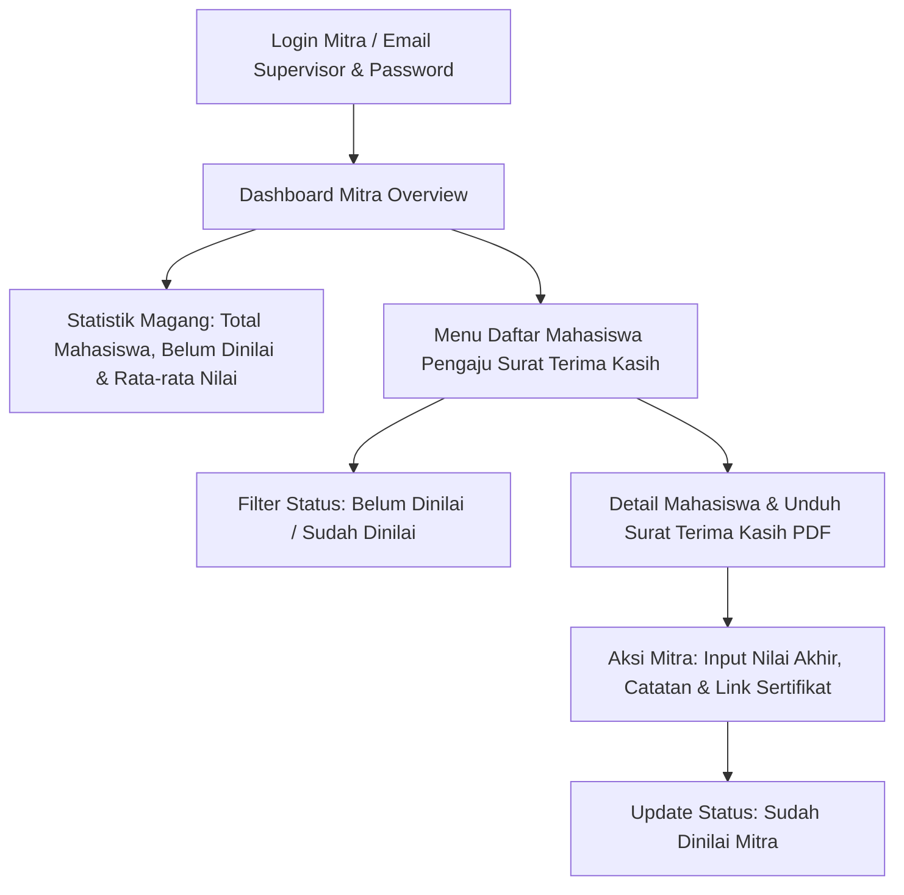
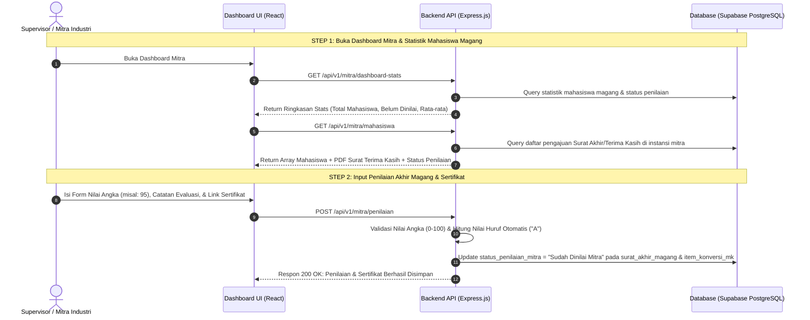

# 🏢 Dokumentasi Lengkap Dashboard Mitra Industri

Dokumen ini berisi panduan teknis, **userflow**, **arsitektur API**, **struktur data**, dan **penilaian akhir magang** untuk **Dashboard Mitra Industri** pada sistem BIMA (MBKM Fakultas Ilmu Komputer Universitas Amikom Yogyakarta).

---

## 📌 1. Ikhtisar Dashboard Mitra Industri

Dashboard Mitra Industri merupakan portal khusus bagi **Supervisor / HRD Mitra Industri** tempat mitra dapat:
1. Memantau daftar mahasiswa yang magang di perusahaannya dan telah mengajukan **Surat Ucapan Terima Kasih FIK (Surat Akhir Magang)**.
2. Mengunduh PDF Surat Ucapan Terima Kasih dari FIK Amikom.
3. Menginputkan **Penilaian Akhir Magang (Nilai Angka 0-100 & Huruf)**.
4. Memberikan **Umpan Balik / Catatan Evaluasi Kinerja Magang**.
5. Mengunggah atau melampirkan **Link Sertifikat Magang**.



---

## 🔄 2. Userflow & Sequence Diagram Penilaian Mitra



---

## ⚡ 3. Daftar Endpoint API Mitra

Semua endpoint Mitra dilindungi oleh authentication token (`Bearer JWT`) dan role authorization (`requireRole(["MITRA", "ADMIN_PRODI", "DEKAN"])`). Endpoint ditempatkan pada prefix `/api/v1/mitra`.

### 1. Ringkasan Statistik Dashboard Mitra
- **URL**: `GET /api/v1/mitra/dashboard-stats`
- **Response Format (200 OK)**:
  ```json
  {
    "status": 200,
    "message": "Statistik Dashboard Mitra Industri berhasil diambil",
    "data": {
      "mitra": {
        "id_mitra": 1,
        "nama_perusahaan": "PT GoTo Gojek Tokopedia Tbk",
        "nama_supervisor": "Rian Hidayat (Lead Eng GoTo)",
        "email_supervisor": "rian.hidayat@goto.com",
        "kategori_industri": "Technology & Unicorn"
      },
      "ringkasan": {
        "total_mahasiswa_magang": 1,
        "total_belum_dinilai": 0,
        "total_sudah_dinilai": 1,
        "rata_rata_nilai": 95.0
      }
    }
  }
  ```

---

### 2. Daftar Mahasiswa Pengaju Surat Terima Kasih (Dashboard Mitra)
- **URL**: `GET /api/v1/mitra/mahasiswa` (Alias: `GET /api/v1/mitra/surat-akhir`)
- **Query Params**:
  - `search` *(string, opsional)*: Pencarian nama/NIM.
  - `status` *(string, opsional)*: Filter status (`Belum Dinilai`, `Sudah Dinilai`).
- **Response Format (200 OK)**:
  ```json
  {
    "status": 200,
    "message": "Daftar mahasiswa & pengajuan Surat Terima Kasih untuk Mitra Industri berhasil diambil",
    "data": {
      "mitra": {
        "id_mitra": 1,
        "nama_perusahaan": "PT GoTo Gojek Tokopedia Tbk"
      },
      "total_mahasiswa": 1,
      "mahasiswa": [
        {
          "id_surat_akhir": 1,
          "id_pengajuan": 1,
          "nim": "21.11.4001",
          "nama_mahasiswa": "Budi Santoso",
          "email": "budi.santoso@students.amikom.ac.id",
          "prodi": "Informatika",
          "angkatan": "2021",
          "magang": {
            "id_magang_fakultas": "FIK6199373",
            "nama_instansi": "PT GoTo Gojek Tokopedia Tbk",
            "posisi": "Fullstack Developer Intern",
            "tanggal_mulai_magang": "01 Agustus 2026",
            "tanggal_berakhir_magang": "31 Januari 2027",
            "periode_magang": "6 Bulan",
            "surat_terima_kasih_url": "https://fik.amikom.ac.id/surat/SURAT-UCAPAN-TERIMA-KASIH-FIK6199373.pdf"
          },
          "penilaian_mitra": {
            "status": "Sudah Dinilai Mitra",
            "nilai_angka": 95,
            "nilai_huruf": "A",
            "catatan_mitra": "Budi berkinerja luar biasa, sangat mahir menguasai REST API & microservices.",
            "sertifikat_magang_url": "https://drive.google.com/file/d/sertifikat_goto_budi.pdf"
          }
        }
      ]
    }
  }
  ```

---

### 3. Detail Data Mahasiswa Magang & Surat Terima Kasih
- **URL**: `GET /api/v1/mitra/mahasiswa/:nim`
- **Path Parameter**: `nim` (misal: `21.11.4001`).
- **Response Format (200 OK)**:
  ```json
  {
    "status": 200,
    "message": "Detail data mahasiswa magang Budi Santoso (NIM: 21.11.4001) berhasil diambil",
    "data": {
      "mitra": {
        "id_mitra": 1,
        "nama_perusahaan": "PT GoTo Gojek Tokopedia Tbk",
        "nama_supervisor": "Rian Hidayat (Lead Eng GoTo)"
      },
      "mahasiswa": {
        "nim": "21.11.4001",
        "nama": "Budi Santoso",
        "email": "budi.santoso@students.amikom.ac.id",
        "prodi": "Informatika"
      },
      "surat_akhir": {
        "id_surat_akhir": 1,
        "id_magang_fakultas": "FIK6199373",
        "nama_instansi": "PT GoTo Gojek Tokopedia Tbk",
        "posisi": "Fullstack Developer Intern",
        "surat_terima_kasih_url": "https://fik.amikom.ac.id/surat/SURAT-UCAPAN-TERIMA-KASIH-FIK6199373.pdf"
      },
      "penilaian_mitra": {
        "status": "Sudah Dinilai Mitra",
        "nilai_angka": 95,
        "nilai_huruf": "A",
        "catatan_mitra": "Budi berkinerja luar biasa, sangat mahir menguasai REST API & microservices.",
        "sertifikat_magang_url": "https://drive.google.com/file/d/sertifikat_goto_budi.pdf"
      }
    }
  }
  ```

---

### 4. Submit Penilaian Akhir Magang & Sertifikat oleh Mitra
- **URL**: `POST /api/v1/mitra/penilaian` & `PUT /api/v1/mitra/penilaian`
- **Shortcut Alias**: `POST /api/v1/mitra/submit-nilai`
- **Request Body**:
  ```json
  {
    "id_surat_akhir": 1,
    "nim": "21.11.4001",
    "nilai_mitra_angka": 95,
    "nilai_mitra_huruf": "A",
    "catatan_mitra": "Mahasiswa berkinerja luar biasa, proaktif, dan terampil dalam software engineering.",
    "sertifikat_magang_url": "https://drive.google.com/file/d/sertifikat_goto_budi.pdf"
  }
  ```
- **Aturan Validasi**:
  - `nilai_mitra_angka` *(integer/float, mandatory)*: Nilai angka 0 - 100.
  - `nilai_mitra_huruf` *(string, opsional)*: Jika tidak diisi, otomatis dihitung dari `nilai_mitra_angka` (90+ = `A`, 80+ = `A-`, 75+ = `B+`, 70+ = `B`, dll).
- **Response Format (200 OK)**:
  ```json
  {
    "status": 200,
    "message": "Penilaian & evaluasi kinerja magang mahasiswa oleh Mitra Industri (PT GoTo Gojek Tokopedia Tbk) berhasil disimpan",
    "data": {
      "id_surat_akhir": 1,
      "nim": "21.11.4001",
      "status_penilaian_mitra": "Sudah Dinilai Mitra",
      "penilaian_mitra": {
        "nilai_angka": 95,
        "nilai_huruf": "A",
        "catatan_mitra": "Mahasiswa berkinerja luar biasa, proaktif, dan terampil dalam software engineering.",
        "sertifikat_magang_url": "https://drive.google.com/file/d/sertifikat_goto_budi.pdf",
        "evaluator": {
          "id_mitra": 1,
          "nama_perusahaan": "PT GoTo Gojek Tokopedia Tbk"
        }
      }
    }
  }
  ```

---

## 🧪 4. Panduan Testing / cURL

```bash
# 1. Login sebagai Mitra Industri (GoTo)
curl -X POST http://localhost:3001/api/v1/auth/login \
  -H "Content-Type: application/json" \
  -d '{"identifier": "rian.hidayat@goto.com", "password": "Mtr#1234"}'

# 2. Get Dashboard Stats Mitra
curl -X GET http://localhost:3001/api/v1/mitra/dashboard-stats \
  -H "Authorization: Bearer <TOKEN>"

# 3. Get Daftar Mahasiswa & Surat Terima Kasih
curl -X GET http://localhost:3001/api/v1/mitra/mahasiswa \
  -H "Authorization: Bearer <TOKEN>"

# 4. Submit Penilaian Akhir Magang & Sertifikat
curl -X POST http://localhost:3001/api/v1/mitra/penilaian \
  -H "Authorization: Bearer <TOKEN>" \
  -H "Content-Type: application/json" \
  -d '{
    "id_surat_akhir": 1,
    "nim": "21.11.4001",
    "nilai_mitra_angka": 95,
    "catatan_mitra": "Kinerja sangat luar biasa.",
    "sertifikat_magang_url": "https://drive.google.com/file/d/sertifikat_budi.pdf"
  }'
```
